# Week 1 – Make-A-Thing

**Project:** Pac-Man Variation – Inverted Authority Mode  
**Date:** January 15 - 22, 2026 (project start)

## Overview

For my Make-A-Thing project, I created a Pac-Man variation that reverses the traditional player–game relationship because I think people already played too much the original version of Pac-Man. Instead of controlling Pac-Man directly, the player controls the environment by removing and placing walls. Pac-Man becomes an autonomous agent, while the player intervenes indirectly through the system.

## What Worked

Walls cannot be created freely; the player must first remove an existing wall to gain wall stock, which can then be used to block other areas. This immediately introduced meaningful constraints. I also allowed walls to be placed on dot and power-dot tiles without permanently deleting them, which made interventions temporary rather than destructive.

# Week 2 – Unity Basics

**Project:** Basket Movement Exercise

**Date:** January 22 – 29, 2026

## What
This week focuses on getting familiar with Unity’s basic workflow and input system.  
The goal of the exercise is to create a basket that moves horizontally and stays within the screen boundaries.

Because Unity has switched to the new Input System, older keyboard input code did not work as expected. The movement logic was rewritten using the current input structure. The basket can now move left and right smoothly and is constrained within a defined range on the x-axis.

## Why
This exercise is mainly about understanding Unity rather than completing a full game.  
Dealing with input system changes highlighted how important it is to adapt code structure to the engine version instead of relying on outdated examples.

By limiting the scope to movement and boundaries, it became easier to understand how `Update()`, transforms, and frame-based motion work together.

## What Next
The next step is to add falling objects and collision detection so the basket can catch items.  
After that, a simple scoring system and game-over condition will be implemented to turn this into a complete mini-game.

# Week 3 – Unity Basics II

**Project:** Basket Movement Exercise (completed)  
**Date:** January 29 – February 5, 2026

## What
This week builds directly on last week’s basket movement exercise by turning it into a simple playable prototype. Using movement, colliders, and basic instantiation, we created a mini-game where objects fall from the top of the screen and the player controls a basket to catch them.

The basket movement from last week was reused, and falling objects were added using prefabs. Collision detection was implemented so that when an object enters the basket’s collider, it is counted as a successful catch. A basic scoring system was added to track how many objects the player collects.

## Why
The goal of this exploration is to test whether a small set of core mechanics could work together as a system. Specifically, this prototype focuses on how movement, collisions, and score tracking interact in real time.

By keeping the mechanics simple, it was easier to understand how Unity handles collisions, object instantiation, and state changes during gameplay. This also helped clarify how small logic changes can quickly affect the overall feel of a game.

## What Next
If this prototype were to be explored further, the next step would be to introduce variation and challenge. For example, different types of falling objects could be added, including ones that reduce the score or trigger a game-over state.

Other possible extensions include increasing difficulty over time, adding visual or sound feedback when items are caught, or experimenting with different control schemes. 

## Week 3 — Class Notes 

### Three Corners of Prototyping

We discussed three main “corners” of prototyping, with **integration** at the center.

1. **Look & Feel Prototype**  
   Focuses on the game’s appearance and overall visual style.  
   It shows what the game is going to look like and helps attract interest and investment.

2. **Role / Flow Prototype**  
   Focuses on user actions and steps.  
   It answers questions like:  
   - If the player clicks this button, what happens next?  
   - If they choose a different option, what is the next step?  
   Examples include task flows such as taking notes or creating tasks.

3. **Implementation / Technical Prototype**  
   Focuses on technology and feasibility.  
   The main question is whether the idea can actually work with the available tools and technology.

These three areas meet in the center through **integration**.

### Why Start From These Three Corners?

- Faster and cheaper than building a full product  
- Helps generate interest early  
- Allows early testing of whether a game or product could be successful  

---

### Prototype Goals

1. **Understand**  
   - The problem  
   - The target audience  
   - The proposed solution  

   Example:  
   The personal transport devices around 2016 failed partly because they were not tested in extreme or real-world conditions. They assumed wide sidewalks, but many European cities have narrow streets and stairs, making the product impractical and expensive.

2. **Communicate**  
   - Use sketches or simple visuals to explain ideas clearly  
   - Helps teams and stakeholders understand the concept quickly

3. **Test and Improve**  
   - Observe how people react to the prototype  
   - Test whether users can understand where to go or what to do  
   - Example: user guidance in games or platforms like Amazon

---

### Prototype Fidelity

1. **Low Fidelity** — test basic assumptions  
   - Paper prototypes  
   - Storyboards  
   - Wireframes  
   - Simple circuit building  

2. **Mid Fidelity** — more refined assumptions  
   - Clickable prototypes  
   - Style guides  
   - Coded prototypes  
   - Tools like InVision or Adobe XD  

3. **High Fidelity** — small details  
   - Button size  
   - Button color  
   - Visual polish and fine interactions  

---

### Types of Fidelity

- Visual  
- Breadth (how much of the system is covered)  
- Depth (how detailed each part is)  
- Interactivity  
- Data model (content)

---

### Choosing Fidelity

The type and level of fidelity should be chosen based on the question being asked.  
For example: *“How does a user enter this system?”* requires different fidelity choices than *“Is this button color readable?”*.

## Chapters 20–24 — Lecture notes (C# / Unity)
**Variables & Scope**
- Variable = type + name + value
- Common types: `int`, `float` (`f` required), `bool`, `string`
- Unity types: `Vector3`, `GameObject`, `Transform`, `Color`
- Fields: class-level, shared across functions, `public` visible in Inspector
- Local variables: function-level, limited scope
- `null` is common in Unity → always check before use

**Booleans & Conditionals**
- Comparison operators: `==`, `!=`, `>`, `<`, `>=`, `<=`
- Logical operators: `&&`, `||`, `!`
- Use `if / else if / else` for branching logic
- Never confuse `=` (assignment) with `==` (comparison)
- Avoid `float ==` → use ranges or thresholds instead

**Loops**
- `for`: repeat a fixed number of times
- `foreach`: iterate collections (do not modify inside loop)
- `while / do-while`: risk of infinite loops
- `break` exits loop, `continue` skips iteration
- Modulo (`%`) used for periodic checks

**Collections**
- `List<T>`: dynamic size, uses `Count`
- Arrays: fixed size, uses `Length`
- `Dictionary<TKey, TValue>`: fast key-based lookup
- Always check `ContainsKey` before accessing dictionary values
- Never remove elements from a `List` inside `foreach`

**Functions**
- Function structure: `returnType FunctionName(parameters)`
- `void` functions return nothing; `return` exits early
- Parameters ≠ arguments
- Function order does not matter
- Functions use PascalCase naming
- Optional parameters must come last
- Overloading uses same name with different parameters
- `params` allows variable arguments (must be last parameter)
- Recursion requires a base case

**High-Frequency Rules**
- Repetition → `for`
- Collection iteration → `foreach`
- Dynamic data → `List`
- Fixed data → array
- Fast lookup → `Dictionary`
- Always protect against `null`
- Avoid float equality checks

# Week 4 – Breakout Prototype
**Project:** Breakout (2D)

**Date:** February 5 – February 12, 2026

## What
This week we focused on restructuring the ball system so that it becomes the central controller of scoring, pacing, and round resets for the breakOut game.
The ball now manages:

- Scoring system: each brick now awards points when hit, so every successful bounce has a clear reward. Players gain points when the ball hits the left or right wall.

- The ball resets to the center after a point is scored

- Lives / penalty: when the ball goes out of bounds, the player loses a life. This turns “missing the ball” into a meaningful consequence instead of just a reset.

- The launch direction is randomized each round

- Different bounce behavior (material-based): we added collision logic that changes feedback and speed depending on what the ball hits. In my OnCollisionEnter2D, I used tags like "Wall" and "Paddle" to trigger different sound pitch.

- UI + ending state: I added a life bar / life display, a Game Over screen, and a final score display so the game has a clear endpoint and summary of performance.

Overall, the prototype now supports a basic loop: hit bricks → gain score → try not to lose lives → game over → show final score. Compared to previous weeks, the prototype feels more like a playable game rather than just a physics experiment.

## Why
My goal this week was to introduce structure and pacing.

- Adding scoring gives players a clear objective. Points turn brick hits into measurable progress, which helps the player understand what “good play” looks like and motivates improvement. 

- Lives create pressure and force the player to read the ball’s movement more carefully. Without a penalty, missing the ball doesn’t matter, and the game feels flat.

- Adding resets introduces rhythm between rounds.

- Adding a short delay before relaunch reduces chaos and makes the game easier to read.

- Even small changes like sound variation helped make different interactions feel intentional.

Overall, I wanted to move from “objects colliding” to a system that has beginnings, endings, and measurable progress. And Game Over + final score gives closure.

## What Next
If I were to continue improving this game in the future, I could add: 

---

### 1. Gameplay Mechanics Improvements

#### Progressive Difficulty
- Gradually increase ball speed after each successful paddle hit  
- Introduce a maximum speed cap to prevent loss of control  
- Create escalating tension over time  

#### Brick Variations
- Strong bricks (require multiple hits)  
- Speed-altering bricks  
- Special bricks that trigger multi-ball  

#### Power-Ups (This could be a time-limited effect when player breaks some special bricks.)
- Paddle extension  
- Slow motion effect  
- Multi-ball mode  
- Temporary shield  

#### Combo System
- Reward consecutive hits without losing a life  
- Add score multipliers for skilled play  

---

### 2. Game Structure Improvements

#### Game Manager System (structrue)
- Separate ball physics from scoring and game state logic  
- Improve modularity and scalability  

#### Clear Game States
- Start Screen  
- Countdown  
- Playing  
- Point Scored  
- Game Over  
- Restart  

#### Win Conditions
- First to 10 points for example  
- Clear end-of-game resolution  

#### Level System
- Different brick layouts  
- Increasing difficulty per level  

---

### 3. Player Experience Enhancements

#### Visual Feedback
- Particle effects on brick hit  
- Screen shake on impact  
- Flash effect when losing a life  

#### Audio Layering
- Scoring sound  
- Game over sound  
- Dynamic background music based on intensity  

#### UI Animation
- Animated score updates  
- More expressive life bar  

#### Pacing Control
- Adjust delay timing between rounds  
- Experiment with tempo variations  

# Week 5 – Animation as Gameplay Mechanic
**Project:** Parkour / Platforming Test Game (Unity)

**Date:** February 12 – February 19, 2026

## What
This week I built a small parkour prototype in Unity, mainly as a personal test project to apply what we learned about animation last week. Instead of treating animation as “just visuals,” I tried to make it part of the actual gameplay loop.

The opening area is set on a fishing boat. The character starts on the deck, and the boat has a looping rocking animation to imitate waves. It’s a simple idea, but it immediately changes how the player experiences movement: even standing still feels slightly unstable, and jumping has a different “timing” compared to a flat ground. I liked that it communicates the environment without any explanation, the player feels the sea, not just sees it.

After that, I also added floating wood pieces in the ocean as the main platforming path. Each piece has an animation that makes it drift and bob up and down, and sometimes slide a little side-to-side. Visually it looks more natural (like objects actually floating), but functionally it becomes a moving platform system. The player has to step onto these pieces to cross, so the animation becomes a real challenge: you have to watch the pattern, wait for the right moment, and commit to a jump.

One thing I paid attention to is that the motion can’t be “random” if it’s meant to be playable. If the platform moves unpredictably, it stops feeling like a skill-based obstacle and starts feeling like luck. So I kept the motion looped and readable, and I tried to make the rhythm consistent enough that a player can learn it after failing once or twice.

  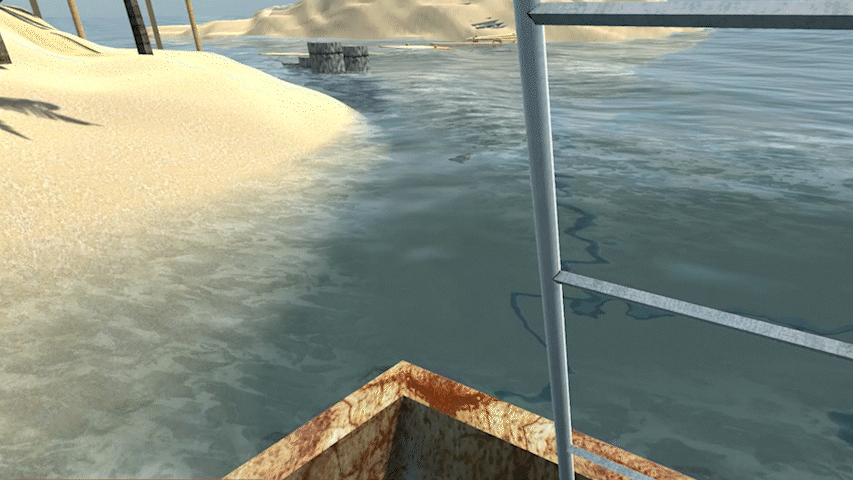
  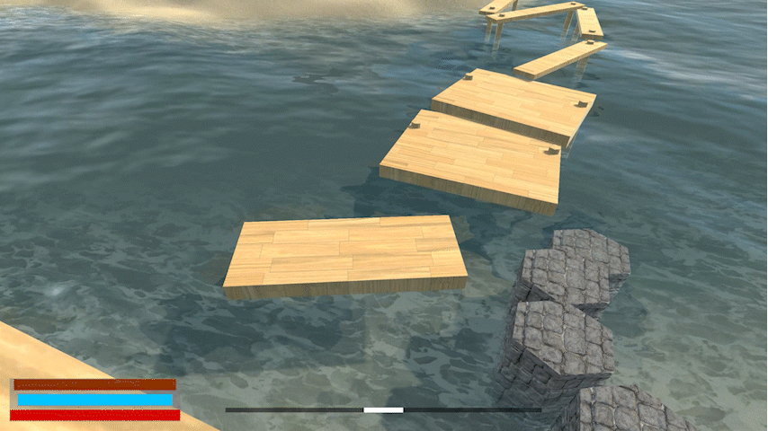

## Why
I chose to focus on animation because I realized I often treat it as an “extra” that comes after mechanics are done. But in a lot of games I enjoy, moving environments are part of what makes the gameplay interesting, not because they look good, but because they create timing, tension, and decision-making. This week I wanted to test whether I could build that feeling using Unity’s animation workflow.

The fishing boat is a good example. The rocking doesn’t just decorate the scene, it sets the mood and teaches a rule: the ground can shift. It also creates a small psychological effect. Even though it’s subtle, it changes how confident you feel when you move. It makes the space feel less “safe,” which fits the ocean theme and makes the start of the game feel more alive.

The animation of the floating wood platforms makes the world feel believable, but it also forces the player to think differently. On a static platform, you can jump whenever you want. On a moving platform, you have to observe first, then act. That extra step is important because it changes the player from “just moving” into “reading the environment.” I think that’s a big part of what makes platforming feel engaging rather than repetitive.

This also made me think about how design systems can overlap. Normally, you’d separate “look” and “mechanics,” but here they become the same thing. The movement pattern is both a visual language (waves, floating) and a gameplay rule (timing, difficulty). When those two match, the game feels more coherent, and the player doesn’t need tutorials to understand what’s happening.

So the deeper takeaway for me is: animation can be used as a design tool, not only for polish. It can control pacing, difficulty, and even the emotional tone of a space.

## What next
If I continue developing this prototype, I want to explore more ways to make animation-driven environments feel intentional and “designed”.

One direction is to expand the level design around animated obstacles:

- platforms that move in different cycles (slow vs fast, vertical vs horizontal)

- “safe” timing windows that reward patience and observation

- sections where the movement gradually becomes more complex, so difficulty ramps naturally

Another direction is to apply this idea to other genres, especially the kinds of projects I’m interested in long-term. I can imagine using animation for a moving maze where corridors shift over time, forcing the player to memorize patterns or wait for openings. Or a puzzle game where the environment is basically a clock, the level changes state through animation cycles and the player has to solve it by syncing their actions with the world.

I also want to push it in a more atmospheric direction. In a future project (like a horror exploration or “Backrooms” style space), animation doesn’t have to be obvious. Subtle motion can make a place feel unsettling: walls that slightly drift, lights that pulse, objects that sway even when there’s no wind. If that motion is also tied to gameplay (ex: timing doors, shifting paths, hiding routes), it could make the experience feel more immersive and less like “a set of static rooms.”

On the technical side, I want to get better at connecting animation systems with gameplay logic. Right now I’m using looping animations, but next I want to test:

- using Animator states to change platform behavior (normal → unstable → safe)

- triggering animation phases based on player proximity

- mixing animation with physics carefully so it still feels consistent

The main goal is to keep developing the idea that animation is not separate from mechanics. This week was my first attempt at that, and it made me more interested in designing worlds where motion is part of the rules, not just decoration.

# Week 6 – Design Journal: Iterative Prototype 1

**Date:** February 19 – February 26, 2026
## What
This week I focused on exploring three different concepts before committing to a direction. Instead of thinking about genre first, I was trying to think about rule systems: what single rule could change the way the player behaves?

My three ideas were:
- A horror game where the enemy only moves when the player moves.
- A parkour-based movement game focused on physical flow and rhythm.
- A Backrooms-style maze puzzle game centered on environmental unease and spatial confusion.
After comparing them, I decided to prototype the first idea because it is the most mechanically focused and rule-driven.
The core concept is very simple:
The enemy only moves when the player moves.

There is no complex combat system, no skill tree, no visible UI. In fact, I am intentionally imagining the game with almost no UI at all. No health bar, no minimap, no objective marker. I think removing interface elements can increase immersion. The player should not feel like they are managing systems, they should feel like they are trapped in a space.

In this idea, the player only needs:
- Movement keys
- One interaction key

That’s it.

The goal is to escape. To do that, the player must explore the space and collect a few key items to unlock an exit, similar to the structure of games like the early Resident Evil series, where progress is gated by objects rather than skill checks. But unlike those games, there is no combat here. You cannot fight the enemy. You can only move — or choose not to.

The enemy is also not a jump-scare type creature. It doesn’t suddenly scream or rush the camera. Instead, it begins very far away. At first, the player might not even understand what it is. Maybe it’s just a silhouette in a hallway. Then, after moving once, they notice something feels different. It’s slightly closer.

Over time, the player realizes the rule:
When they move, it moves.

That realization is the real horror moment.

From that point on, movement becomes a decision. Every step forward means allowing the threat to advance. Stillness becomes a temporary safety, but also a trap, because staying still means you cannot reach the items you need to escape.

I like this because the tension does not come from surprise. It comes from awareness. The enemy doesn’t need to be loud or visually extreme. It just needs to be persistent and quiet.

## Design Values
What I care about in this concept:

- Minimalism
- Mechanical tension instead of scripted horror
- Psychological pressure instead of jump scares
- Player hesitation as gameplay

I am especially interested in how limitation creates anxiety. In most games, movement feels empowering. Here, movement is risky. It forces the player to calculate distance, space, and timing constantly.

I also think removing UI reinforces this. If there is no health bar, the player doesn’t know exactly how close they are to death. If there is no distance indicator, they must judge visually. That uncertainty can make the experience feel more physical and immediate.

## Precedents
This idea is loosely related to the VR game Superhot (2016), where time only moves when the player moves. But in that game, the mechanic empowers the player. In my idea, the mechanic creates vulnerability.

There is also a connection to horror tropes like the “Weeping Angels” from Doctor Who, where creatures move only when not observed. But again, my version focuses less on visibility and more on action itself.

The closest structural comparison might be early survival horror like Resident Evil, where space is limited and progress is tied to collecting keys and unlocking doors. However, I want to remove combat entirely and reduce the interaction to its most basic form.

## Prototype
For this week, I made a very simple paper prototype using a grid and two markers: one for the player, one for the enemy. Enemies need to maneuver around the striped grid (a certain movement restriction gives players room for error).

Rules:
- The player can move one square per turn.
- Every time the player moves, the enemy also moves one square toward the player.
- The player must collect three items before reaching the exit.

  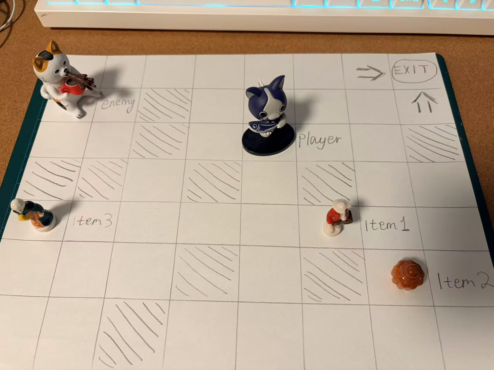

I found myself hesitating before moving. I tried to calculate how far I could go before the enemy would catch up. Sometimes I chose to wait, even though waiting did not help me progress. That feeling of being stuck between safety and necessity felt strong even without visuals.

This confirmed that the mechanic itself is capable of generating pressure. Interestingly, I also noticed that the items changed how I moved. Instead of heading directly toward the exit, I had to deliberately expose myself to danger to collect them. This created moments where I intentionally “fed” the enemy distance in order to gain progress. That trade-off felt meaningful.

## What Next
Next week, I may want to build a very small digital prototype in Unity if I had a chance.
I will:
- Create a simple dark environment (maybe just corridors and rooms).

- Implement the movement-linked enemy behavior.

- Add 2–3 collectible items that unlock a final door.

- Test how lighting affects the experience (for example, making the enemy barely visible at first).

I also want to experiment with pacing:
- Should the enemy move at the same speed as the player?
- Slightly faster?
- Should it start extremely far away?
I also want to test whether removing UI truly increases immersion, or if some minimal feedback (like subtle sound cues) is necessary for clarity.
The goal is not to make a full game yet. It’s to see whether the mechanic still creates tension in real-time space, not just on paper.
Right now, I think this idea has the strongest mechanical identity out of the three. It feels focused, scalable, and psychologically interesting.
But first, I want to test the rule itself.

# Extra Credit – Design Journal - Game Analysis
## Game Analysis: Armored Core VI

---
**What Makes the Game Mechanically Interesting**
Armored Core VI: Fires of Rubicon is a high-speed mech action game built around one core idea: movement + resource management define combat outcomes.
While I can't say it's a soul-like game, but since it's made by the compagnie that made Dark Souls (FromSoftware), I believe it incorporates many of their game-making philosophies.
Although the narrative takes place on Rubicon 3, what makes the game compelling is not the story, but how the combat systems are structured.
1. Build Customization as Mechanical Commitment
The most important system in the game is customization.
Swapping:
- Frame
- Weapons
- Generator
- Booster

  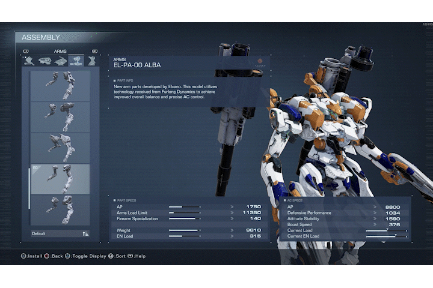
  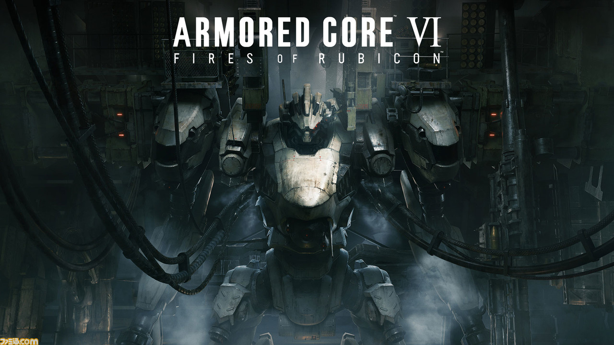
  

it does not just slightly adjust stats — it fundamentally changes:
- Movement speed
- Energy regeneration
- Stability
- Engagement range
- Risk tolerance
This forces players to commit to a playstyle before combat even begins.
This is mechanically powerful because:
- Build decisions meaningfully constrain tactical options.
- The game does not allow one universal solution.
- Preparation becomes part of gameplay, not just setup.
The design ensures that the “meta-game” (garage tuning) directly affects moment-to-moment combat flow.

---
2. Movement as Expressive System
Combat revolves around four core movement states:
- Walking (cost-free baseline)
- Boost (sustained repositioning)
- Glide (vertical positioning)
- Quick Boost (instant dash / dodge)

  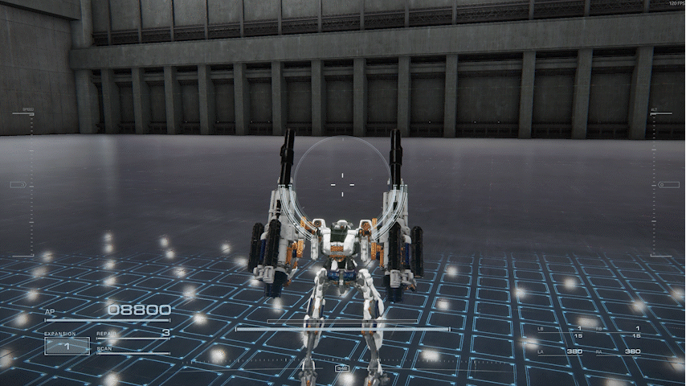
  
  
  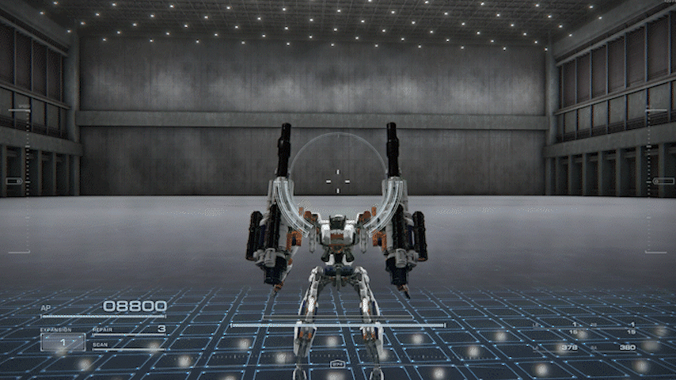
  

These are not cosmetic animations, they are resource-driven decisions tied to the EN (energy) bar.
Quick Boost, especially, is critical. It consumes energy instantly and forces a trade-off:
Dodge now? Or conserve energy for offense?
This creates a constant tension between mobility and aggression.
Mechanically, this works because:
- Movement is readable
- Energy consumption is visible
- Mistakes are punishable (HP reduction) but understandable

---
3. Boss Design as System Stress Test
To really understand how these systems come together, it’s useful to look at a specific example: the early boss fight against Armored Core VI: Fires of Rubicon’s Balteus.

  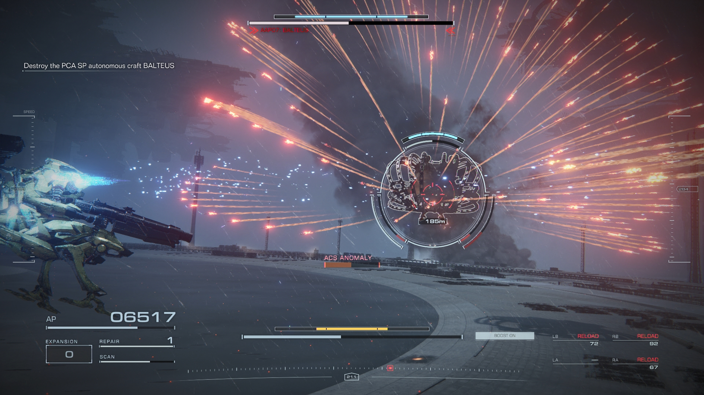
  

Balteus is overwhelming at first. It launches constant missile barrages, uses a pulse shield that needs to be broken, and follows up with heavy laser attacks. The screen fills with projectiles, and it feels chaotic.
But mechanically, it’s actually very structured.
This fight forces the player to engage with:
- EN management (you cannot spam Quick Boost forever)
- Stagger system (breaking posture to create damage windows)
- Build viability (mobility vs durability)
- Pattern recognition

When I first approached it with a heavy armor build, I assumed I could tank through most of the damage. On paper, that sounded reasonable. But in practice, the missile tracking and shield pressure meant I was constantly stuck recovering, unable to reposition properly. The system exposed the weakness of my build.
After switching to a lighter frame with higher burst damage, the fight changed completely. I had less margin for error, but I could control distance and timing much better.

  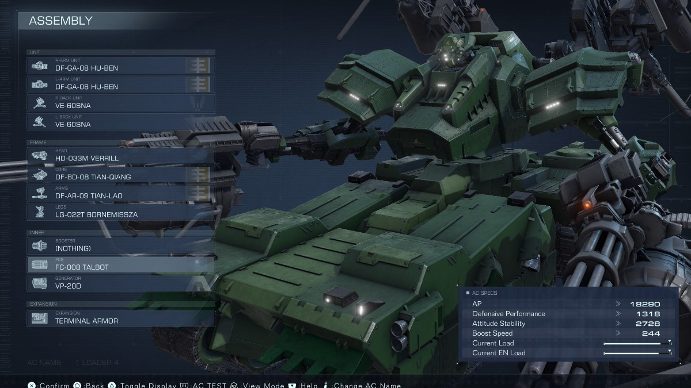
  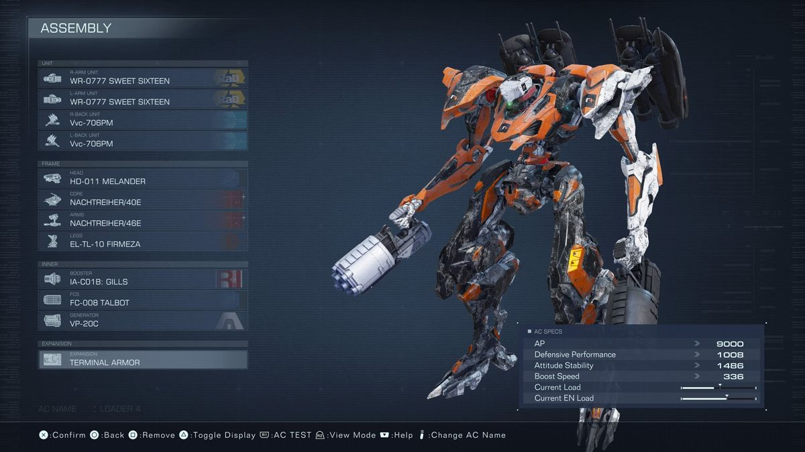
  

This is where the design is strong: the boss is not just a difficulty spike. It is a system check. If your understanding of movement, energy, and build synergy is shallow, you fail. If you adapt, the same systems that felt oppressive start to feel manageable.

---
4. Predictability and Learnability
Another important mechanical decision is that enemy attacks are predictable.
Balteus’s missile waves are not random. The laser bursts follow recognizable sequences. The shield phase has a clear logic.
At first, it feels impossible. But after several attempts, patterns start to emerge.
This matters because difficulty without structure feels unfair. Here, failure usually has a reason:
- I ran out of energy.
- I dodged too early.
- I stayed airborne too long.
- I overcommitted to damage.

The game doesn’t hide information. It simply demands timing and execution.
This predictability turns frustration into learning. The fight transforms from chaos into rhythm. Once I understood the timing of missile volleys and shield breaks, the encounter became less about panic and more about decision-making under pressure.
The satisfaction comes from that shift. Not just from winning, but from recognizing that improvement was measurable.

---
**Where the Game Fails (Mechanically)**:
Even though the combat system is tight, there are weaknesses.
One issue is system clarity.
The stat screen is dense. Terms like “Attitude Stability” or generator output are not always clearly translated into player experience. For new players, it’s hard to understand why a build fails. Is it weight? EN capacity? Booster efficiency? The game expects experimentation, but it doesn’t fully support understanding.
Another issue is pacing.
Balteus appears very early. While it effectively teaches the importance of builds and energy management, it can also act as a hard wall. Some players may feel forced into optimization instead of gradual discovery. Mechanically, it’s sound, but in terms of onboarding, it may be too abrupt.

**What I Would Borrow for Future Projects**:
Looking at my own prototypes in Unity, especially movement-based ones, there are several ideas I would borrow.
First, I like the idea that preparation is gameplay. Instead of upgrades being simple power increases, they could meaningfully alter how a player interacts with a level. For example, in a maze or parkour prototype, choosing a lighter build could increase speed but reduce stamina recovery, changing how the level is approached.
Second, tying movement directly to a visible resource is powerful. In Armored Core VI, energy is like stamina. You see it deplete. You feel its absence. That creates tension. I think I could experiment with this in future projects, maybe limiting sprint, jump, or special actions through a clear, readable system that forces trade-offs.
Third, boss encounters as system exams. Instead of just increasing enemy health, a boss can be designed to test whether players actually understand the mechanics introduced earlier. That creates a sense of progression that is skill-based rather than purely statistical.

**Conclusion**:
Armored Core VI works because its systems are interconnected.
Movement costs energy.
Energy limits aggression.
Build choices define mobility.
Bosses test mastery of those systems.
The game is not interesting because of its theme, but because of how tightly its mechanics reinforce each other.
At its best, every decision has weight.
At its weakest, the systems are not always clearly explained.
For me, the most valuable takeaway is that good design is not about adding more features. It is about making systems interact in meaningful, readable ways.

# Week 7 – Reading week

**Date:**: February 26 – March 5, 2026

# Week 8 – Design Journal: Iterative Prototype 2

**Date:**: March 5 – March 12, 2026
## What
This week I focused on refining the core mechanic and expanding the prototype idea into a more complete game structure. Last week I mainly explored the rule system through a paper prototype: the enemy only moves when the player moves. The test confirmed that this rule alone can create tension, because every step forward also allows the threat to advance.

However, while thinking more about how the game would work in a digital environment, I started questioning whether constantly seeing the enemy follow the player would actually remain scary. If the player can always see the enemy walking behind them, it might quickly stop feeling like horror and instead become a simple distance management problem. The player might begin to treat the enemy like a predictable AI rather than an unknown threat.

Because of this, I began exploring alternative ways the enemy could move or appear in the space while still following the same core rule.

The first idea is that the enemy should not always remain visible to the player. Instead of continuously following behind the player, it could appear in different parts of the environment. For example, the player might see it briefly at the end of a hallway, at the top of a staircase, or standing in a doorway. After the player moves again, the enemy could appear somewhere closer but not necessarily along the same path. This would create the feeling that something is moving through the house with the player rather than simply chasing them from behind.

The second possibility is inspired by horror tropes where creatures only move when they are not observed. In this version, the enemy would still move only when the player moves, but only if the player is not directly looking at it. If the player turns around and looks at the enemy, it would freeze in place. This would encourage players to constantly check behind them, creating a different kind of tension.

Another variation I considered is a teleport-style approach. Instead of physically walking toward the player, the enemy could jump between predetermined locations. For instance, the player might first see it standing at the end of a corridor. After moving forward and looking back, it suddenly appears much closer, perhaps near a doorway or staircase. This would create the unsettling feeling that space itself is shifting around the player.

Finally, I also considered using sound as the primary indicator of the enemy's presence. Instead of always showing the creature visually, the game could rely on footsteps, breathing, dragging sounds, or doors moving somewhere in the house. The player might occasionally catch a glimpse of the enemy, but most of the time they would only hear it moving somewhere nearby.

At the moment, I am leaning toward combining several of these ideas. The enemy would not constantly remain visible, and the player would mainly rely on sound and occasional visual encounters to understand where it might be.

## Expanding the Game Structure
In addition to refining the enemy behavior, I also started outlining the overall structure of the game.
The game does not need to be very large. I am imagining something closer to a small contained experience lasting around 15–30 minutes. The environment would be a multi-floor mansion, somewhat similar to the layout of houses in early survival horror games.
The structure might look something like this:
- First floor
- Entrance hall
- Living room
- Kitchen
- Study
- Second floor
- Bedrooms
- Research room
- Storage areas
- Basement
- Laboratory space
- Final exit

The player would need to explore different parts of the house and collect several key items in order to unlock the final exit.
Like early Resident Evil games, progress would be gated by objects rather than by combat or skill-based challenges. However, unlike those games, the player cannot fight the threat in any way. Exploration itself becomes the main source of risk.

Environnement prototype(Junming): https://github.com/LE7ELS001/CART-315/blob/main/Process/Journal.md#march-5-11---week-8---design-journal-iterative-prototype-2

  
  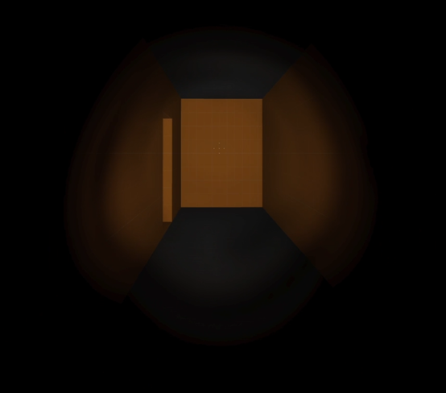
  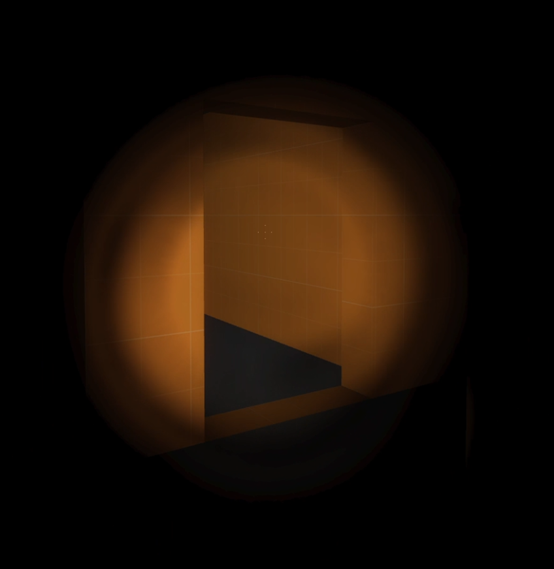
  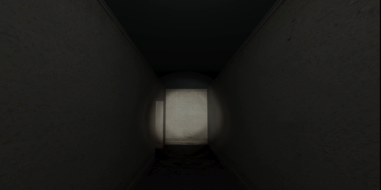
  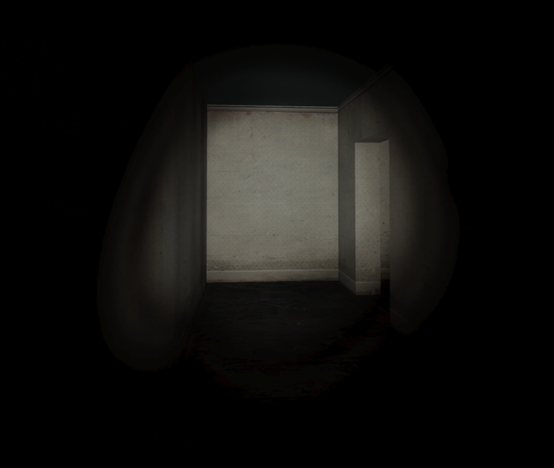

## Player Mechanics
I want to keep the player controls extremely simple. The player would only have three main actions:
- Movement (WASD)
- Run (Shift)
- Interact (E)
There would be no weapons, no inventory management complexity, and almost no user interface elements.
The goal is simply to explore the house, find the required items, and escape.

## Hidden Stamina System

One system I am interested in experimenting with is a hidden stamina system.
Instead of showing a stamina bar on screen, the player’s physical state would be communicated through audio and visual feedback.

For example, when the player runs for too long:
- Breathing sounds become heavier
- The camera begins to shake slightly
- The character’s movement becomes less stable and slow
The lower the stamina, the stronger these effects become.
This approach keeps the interface minimal while still giving the player feedback about their condition. It may also make the experience feel more physical, because the player has to interpret sensory cues rather than reading numbers or meters.

## Narrative Idea
I also began thinking about a possible background story for the environment.
One idea is that the player character is a federal investigator who has come to examine a case connected to the house.
Fifteen years ago, the building operated as a private medical facility or treatment center. One night, all of the patients disappeared. The investigation at the time produced no clear explanation, and the case was eventually closed.
Recently, however, reports have surfaced that lights have been seen inside the abandoned building at night. Because of this, the player has been sent to investigate the location again.
Rather than telling the story directly through dialogue, most of the narrative would be communicated through environmental details such as documents, medical files, notes, and fragments of records found throughout the house.

## Design Reflection
One important realization this week is that horror often comes from uncertainty rather than direct threat. If the enemy is always clearly visible and behaving predictably, the player may begin to treat the game like a system they can solve.
By contrast, when the enemy is only partially visible and sometimes hidden, the player cannot easily calculate the exact situation. They have to rely on intuition and incomplete information.
Because the core rule of this project is already very simple, I think adding ambiguity to the enemy’s presence may help strengthen the psychological tension without adding mechanical complexity.

## What Next
For the next step, I want to start building a very small digital prototype to test these ideas in a real-time environment.
The main goals for the next iteration will be:
- Build a simple house interior with a few connected rooms and corridors.
- Implement the basic rule where the enemy moves when the player moves.
- Experiment with different enemy presentation methods (visible movement, teleportation, and sound cues).
- Add two or three collectible items and a locked exit to test the progression structure.
- Begin testing how lighting and visibility affect the tension of the experience.
At this stage, the goal is not to produce a finished game. Instead, I want to see whether the core rule continues to generate tension when translated from a paper prototype into a playable 3D space.

# Week 9 – Design Journal: Iterative Prototype 3

**Date:**: March 12 – March 19, 2026

## What 
This week I focused on continuing the transition from a conceptual prototype into a playable Unity environment. Since I am now working on the project individually, I decided to narrow the scope and prioritize building a small but functional gameplay loop.

I spent time organizing the environment using online assets and establishing a consistent visual setting. The space now resembles an abandoned medical facility, with corridors, rooms, and objects such as beds, wheelchairs, and lockers. I also implemented basic first-person movement and added a flashlight mechanic. The player can toggle the flashlight using the mouse, which allows them to navigate and reveal details in dark areas.

Compared to previous weeks, the project is no longer just an idea or paper-based system. It is now a navigable 3D space where I can start testing player experience more directly.

  
  
  

## Why
Because I am working alone and this is my first time building a game in Unity, I realized that my initial scope was too ambitious. Earlier, I considered multiple enemy behaviors, large environments, and layered systems, but trying to implement all of these at once would likely slow down progress.

Instead, I decided to focus on a smaller, more achievable goal: creating a simple but complete interaction loop. This means building a structure where the player can explore, interact with objects, and unlock progression.

At this stage, I am prioritizing clarity and functionality over complexity. Establishing a working foundation is more important than adding advanced mechanics too early.

## Reflection
One important realization this week is that the environment itself already contributes strongly to the atmosphere. Even without any enemy present, the combination of darkness, limited visibility, and the flashlight creates a sense of tension.

This made me reconsider how much is actually needed to create a horror experience. Instead of relying on complex AI or constant threats, the feeling of uncertainty can already emerge from the space and the player’s limited perception.

At the same time, I noticed that without interaction, the experience still feels incomplete. The player can move and look around, but there is no clear goal or progression yet. Because of this, the next step is to introduce simple interactions that give the player purpose.

  
  
  
  

## What Next
Next week, I will focus on implementing basic object interaction and progression systems.
The main goals are:
- Add a simple interaction system (pressing a key to interact with objects)
- Implement collectible items such as keys
- Create at least one locked door that requires a key to open
- Provide basic on-screen feedback when the player can interact with something

The aim is to build a minimal gameplay loop: exploration → interaction → unlocking progression.
This will allow me to test whether the space not only feels atmospheric, but also functions as a playable experience.

# Week 10 – Design Journal: Iterative Prototype 4

**Date:**: March 19 – March 26, 2026

## What
This week I made a major change to my project direction. I decided to stop developing the Unity horror prototype and instead switch to a new project using Unreal Engine 4. The new idea is to create a small Souls-like combat experience.

I spent most of the week building the basic player action system. I implemented a dodge roll using the space bar, which allows the player to quickly avoid attacks. I also added combat animations, including two heavy attacks (right mouse button) and four light attacks (left mouse button).

One important part is that these attacks can be chained together. After a heavy attack, the player can immediately continue into a light attack combo without delay, and the same works in reverse. This makes the combat feel more fluid and responsive.

I also attached a sword asset to the character’s hand, so the animations look more natural and readable in the game space.

## Why
I decided to change direction because my previous Unity project was becoming difficult to manage within the time I have. As I worked on it alone, I realized that building a full horror system with environment design, interaction, and AI would take too long to complete properly.

By switching to a Souls-like combat prototype, I can focus on a clearer and more contained system: player actions and combat mechanics. This allows me to build something that is still meaningful but more achievable.

Also, I am personally more interested in action-based gameplay, so this change helps me stay motivated and engaged with the project.

## Reflection
This week helped me understand the importance of scope and choosing the right project direction. Even though I invested time in the previous idea, it was not realistic to complete it at the level I wanted.

The new combat system already feels more interactive and satisfying. Compared to the horror prototype, where the experience depended heavily on atmosphere, this project gives immediate feedback through player actions.

However, right now the system is still very incomplete. There are no enemies yet, so the combat does not have real gameplay meaning. It feels more like testing animations rather than playing a game.

## What Next
Next week, I plan to start building the enemy system and basic gameplay loop. My main goals are:

Define at least two types of enemies (a basic enemy and one boss)
Begin implementing enemy animations and simple behavior
Create interaction between player attacks and enemies
Start designing a simple level flow from point A to point B

The goal is to build a short but complete experience, around 10 minutes long, where the player can fight enemies and reach an ending point.