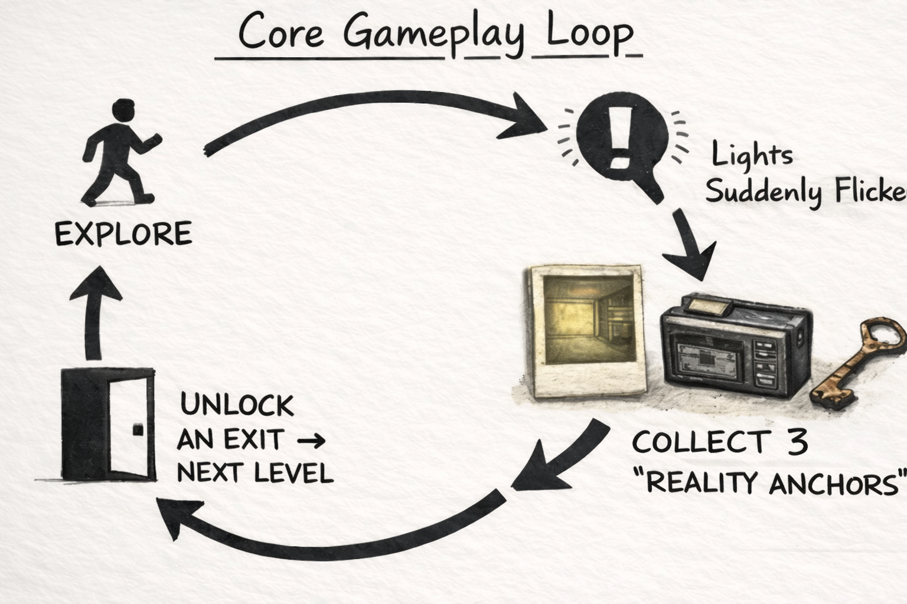
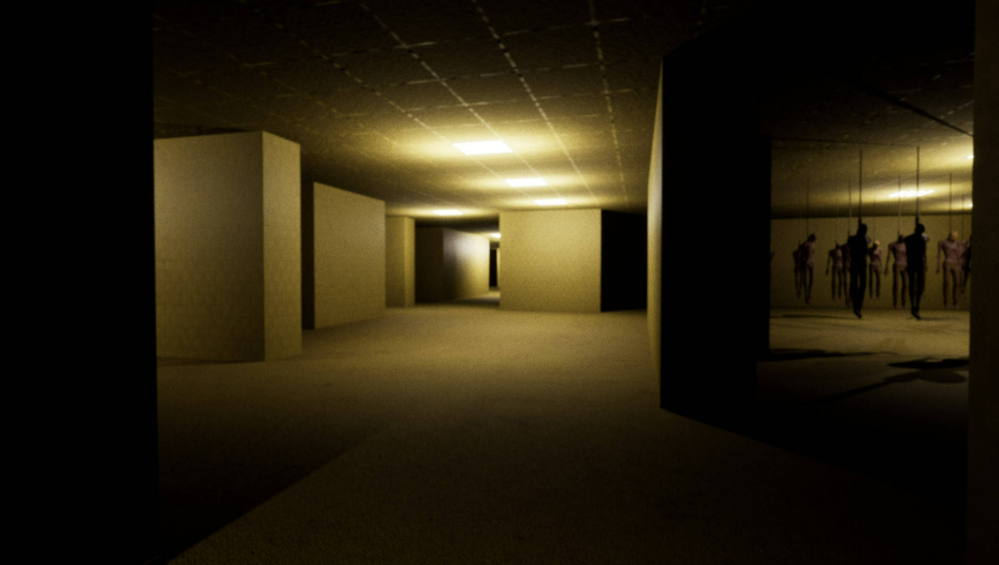
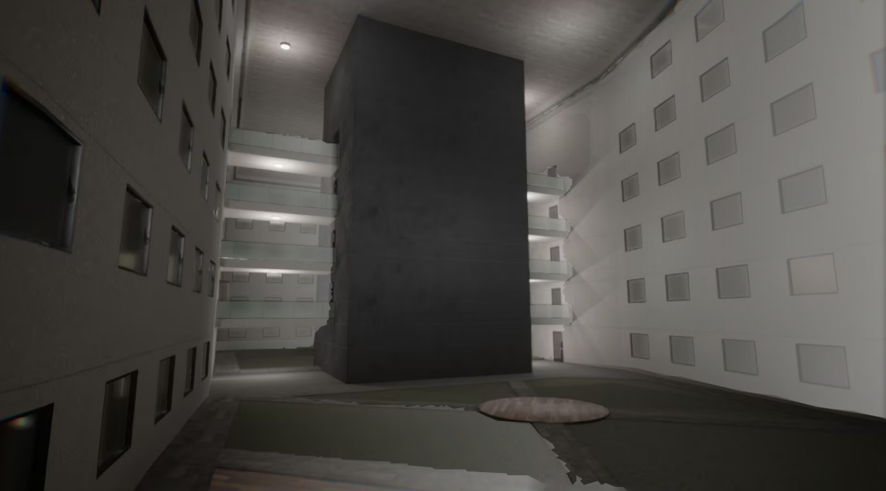
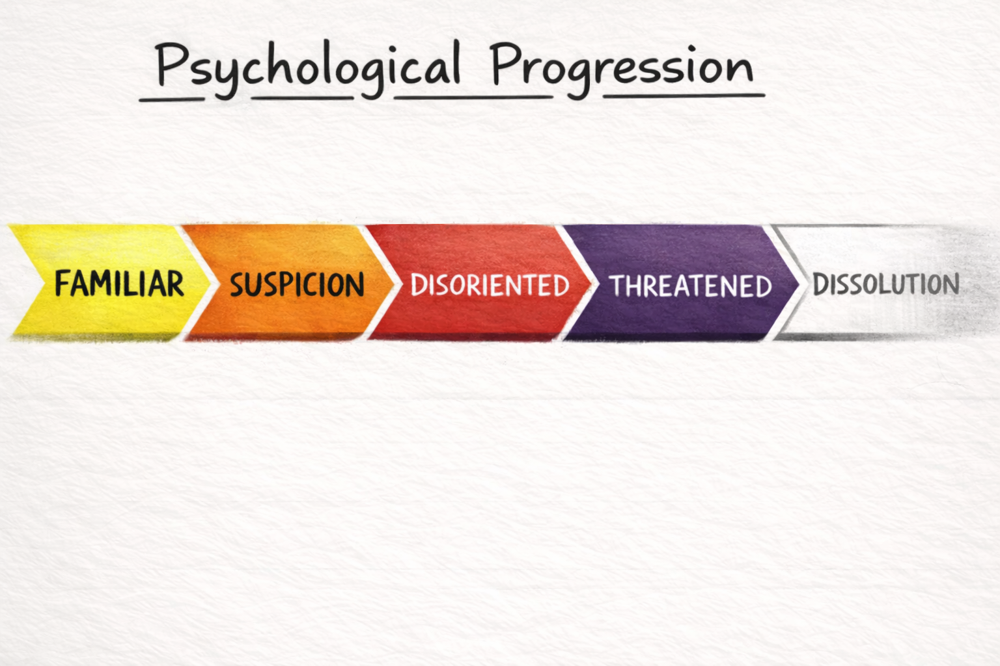

# Week 1 – Make-A-Thing

**Project:** Pac-Man Variation – Inverted Authority Mode  
**Date:** January 15 - 22, 2026 (project start)

## Overview

For my Make-A-Thing project, I created a Pac-Man variation that reverses the traditional player–game relationship because I think people already played too much the original version of Pac-Man. Instead of controlling Pac-Man directly, the player controls the environment by removing and placing walls. Pac-Man becomes an autonomous agent, while the player intervenes indirectly through the system.

## What Worked

Walls cannot be created freely; the player must first remove an existing wall to gain wall stock, which can then be used to block other areas. This immediately introduced meaningful constraints. I also allowed walls to be placed on dot and power-dot tiles without permanently deleting them, which made interventions temporary rather than destructive.

# Week 2 – Unity Basics

**Project:** Basket Movement Exercise

**Date:** January 22 – 29, 2026

## What
This week focuses on getting familiar with Unity’s basic workflow and input system.  
The goal of the exercise is to create a basket that moves horizontally and stays within the screen boundaries.

Because Unity has switched to the new Input System, older keyboard input code did not work as expected. The movement logic was rewritten using the current input structure. The basket can now move left and right smoothly and is constrained within a defined range on the x-axis.

## Why
This exercise is mainly about understanding Unity rather than completing a full game.  
Dealing with input system changes highlighted how important it is to adapt code structure to the engine version instead of relying on outdated examples.

By limiting the scope to movement and boundaries, it became easier to understand how `Update()`, transforms, and frame-based motion work together.

## What Next
The next step is to add falling objects and collision detection so the basket can catch items.  
After that, a simple scoring system and game-over condition will be implemented to turn this into a complete mini-game.

# Week 3 – Unity Basics II

**Project:** Basket Movement Exercise (completed)  
**Date:** January 29 – February 5, 2026

## What
This week builds directly on last week’s basket movement exercise by turning it into a simple playable prototype. Using movement, colliders, and basic instantiation, we created a mini-game where objects fall from the top of the screen and the player controls a basket to catch them.

The basket movement from last week was reused, and falling objects were added using prefabs. Collision detection was implemented so that when an object enters the basket’s collider, it is counted as a successful catch. A basic scoring system was added to track how many objects the player collects.

## Why
The goal of this exploration is to test whether a small set of core mechanics could work together as a system. Specifically, this prototype focuses on how movement, collisions, and score tracking interact in real time.

By keeping the mechanics simple, it was easier to understand how Unity handles collisions, object instantiation, and state changes during gameplay. This also helped clarify how small logic changes can quickly affect the overall feel of a game.

## What Next
If this prototype were to be explored further, the next step would be to introduce variation and challenge. For example, different types of falling objects could be added, including ones that reduce the score or trigger a game-over state.

Other possible extensions include increasing difficulty over time, adding visual or sound feedback when items are caught, or experimenting with different control schemes. 

## Week 3 — Class Notes 

### Three Corners of Prototyping

We discussed three main “corners” of prototyping, with **integration** at the center.

1. **Look & Feel Prototype**  
   Focuses on the game’s appearance and overall visual style.  
   It shows what the game is going to look like and helps attract interest and investment.

2. **Role / Flow Prototype**  
   Focuses on user actions and steps.  
   It answers questions like:  
   - If the player clicks this button, what happens next?  
   - If they choose a different option, what is the next step?  
   Examples include task flows such as taking notes or creating tasks.

3. **Implementation / Technical Prototype**  
   Focuses on technology and feasibility.  
   The main question is whether the idea can actually work with the available tools and technology.

These three areas meet in the center through **integration**.

### Why Start From These Three Corners?

- Faster and cheaper than building a full product  
- Helps generate interest early  
- Allows early testing of whether a game or product could be successful  

---

### Prototype Goals

1. **Understand**  
   - The problem  
   - The target audience  
   - The proposed solution  

   Example:  
   The personal transport devices around 2016 failed partly because they were not tested in extreme or real-world conditions. They assumed wide sidewalks, but many European cities have narrow streets and stairs, making the product impractical and expensive.

2. **Communicate**  
   - Use sketches or simple visuals to explain ideas clearly  
   - Helps teams and stakeholders understand the concept quickly

3. **Test and Improve**  
   - Observe how people react to the prototype  
   - Test whether users can understand where to go or what to do  
   - Example: user guidance in games or platforms like Amazon

---

### Prototype Fidelity

1. **Low Fidelity** — test basic assumptions  
   - Paper prototypes  
   - Storyboards  
   - Wireframes  
   - Simple circuit building  

2. **Mid Fidelity** — more refined assumptions  
   - Clickable prototypes  
   - Style guides  
   - Coded prototypes  
   - Tools like InVision or Adobe XD  

3. **High Fidelity** — small details  
   - Button size  
   - Button color  
   - Visual polish and fine interactions  

---

### Types of Fidelity

- Visual  
- Breadth (how much of the system is covered)  
- Depth (how detailed each part is)  
- Interactivity  
- Data model (content)

---

### Choosing Fidelity

The type and level of fidelity should be chosen based on the question being asked.  
For example: *“How does a user enter this system?”* requires different fidelity choices than *“Is this button color readable?”*.

## Chapters 20–24 — Lecture notes (C# / Unity)
**Variables & Scope**
- Variable = type + name + value
- Common types: `int`, `float` (`f` required), `bool`, `string`
- Unity types: `Vector3`, `GameObject`, `Transform`, `Color`
- Fields: class-level, shared across functions, `public` visible in Inspector
- Local variables: function-level, limited scope
- `null` is common in Unity → always check before use

**Booleans & Conditionals**
- Comparison operators: `==`, `!=`, `>`, `<`, `>=`, `<=`
- Logical operators: `&&`, `||`, `!`
- Use `if / else if / else` for branching logic
- Never confuse `=` (assignment) with `==` (comparison)
- Avoid `float ==` → use ranges or thresholds instead

**Loops**
- `for`: repeat a fixed number of times
- `foreach`: iterate collections (do not modify inside loop)
- `while / do-while`: risk of infinite loops
- `break` exits loop, `continue` skips iteration
- Modulo (`%`) used for periodic checks

**Collections**
- `List<T>`: dynamic size, uses `Count`
- Arrays: fixed size, uses `Length`
- `Dictionary<TKey, TValue>`: fast key-based lookup
- Always check `ContainsKey` before accessing dictionary values
- Never remove elements from a `List` inside `foreach`

**Functions**
- Function structure: `returnType FunctionName(parameters)`
- `void` functions return nothing; `return` exits early
- Parameters ≠ arguments
- Function order does not matter
- Functions use PascalCase naming
- Optional parameters must come last
- Overloading uses same name with different parameters
- `params` allows variable arguments (must be last parameter)
- Recursion requires a base case

**High-Frequency Rules**
- Repetition → `for`
- Collection iteration → `foreach`
- Dynamic data → `List`
- Fixed data → array
- Fast lookup → `Dictionary`
- Always protect against `null`
- Avoid float equality checks

# Week 4 – Low-Fidelity Prototype — Backrooms-Inspired Unity Game

**Date:** February 5 – February 12, 2026

## What
This week I focused on making a low-fidelity prototype for my game concept before touching Unity. The idea is a Backrooms-inspired exploration experience where the player moves through repetitive liminal spaces, and the environment subtly changes over time. Instead of building a full map, I sketched a modular structure: small hallway/room “chunks” that can be repeated, rearranged, or swapped so the space feels endless.

For the prototype, I made quick floorplan sketches and a simple level flow for five layers (Level 1–5). Each level is not a totally different map, but a different “state” of the same system: lighting shifts, sound becomes less stable, and anomalies become more frequent. I also outlined a basic gameplay loop: explore → notice anomalies → collect 3 “reality anchors” → unlock an exit to the next level. The anomalies are the main design element (lights flicker, sound cuts, wrong door, space changes when you turn around), and I listed a small set of anomaly events that could be implemented cheaply.
****

  
  

## Why
Because this is my first time making a Unity game, I wanted to avoid jumping into production too early and getting stuck on technical problems without knowing what I’m actually building. The low-fidelity stage helped me clarify what the “Backrooms feeling” should come from: not high-poly graphics, but repetition, uncertainty, and subtle rule-breaking.

The five-level structure is also a design decision, not just “more content.” I’m using levels as a psychological progression: familiar → suspicious → disoriented → threatened → dissolved. Keeping one consistent system and changing parameters (light, sound, anomaly rate, sanity drain) makes the scope realistic while still showing strong concept development. This prototype stage also forced me to define what counts as success for the demo: if the player can get lost, notice changes, and feel tension building—even with simple geometry—then the design is working.
****

## What Next
Next week I’ll start the Unity demo with a small, controlled scope: one playable level (Level 1) plus a lightweight framework that can scale into the other levels. My goals are:

- Build a basic first-person controller and a simple modular hallway/room set (8–12 prefabs).

- Implement a sanity/pressure system that increases over time and affects anomaly probability.

- Create an Anomaly Manager with 3–5 anomalies (light flicker, sound cut, wrong door, room swap behind the player).

- Add a simple objective: collect 3 reality anchors to spawn an exit door.

If time allows, I’ll add a minimal “presence entity” (non-combat) that only appears under high sanity pressure, mainly to increase tension rather than create a full enemy system. The main priority is to prove the experience and rules in a small demo rather than expanding the map size.

